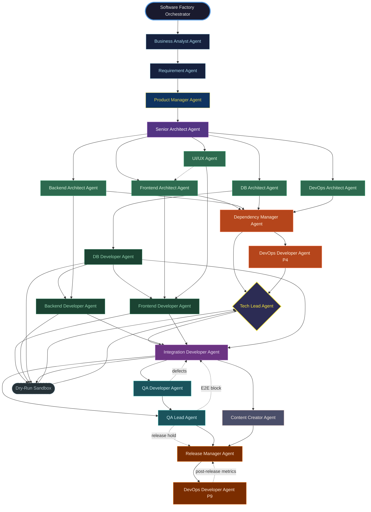

# Software Factory — Agent Dependency Graph

---

## Full Pipeline Graph (Mermaid)



---

## Dependency Matrix

The table below lists every agent, the agents it directly depends on (blocking),
the agents it can run in parallel with, and the agents it hands off to.

| Agent | Phase | Depends On (blocking) | Parallel With | Hands Off To |
|-------|-------|-----------------------|---------------|-------------|
| `software_factory_orchestrator` | Entry | — | — | `requirement_agent` |
| `business_analyst_agent` | P0 | `software_factory_orchestrator` | — | `requirement_agent` |
| `requirement_agent` | P0 | `business_analyst_agent` | — | `product_manager_agent` |
| `product_manager_agent` | P1 | `requirement_agent` | — | `senior_architect_agent` |
| `senior_architect_agent` | P2 | `product_manager_agent` | — | all P3 agents |
| `ui_ux_agent` | P3 | `senior_architect_agent` | `frontend_architect`, `backend_architect`, `db_architect`, `devops_architect` | `frontend_architect_agent`, `frontend_developer_agent` |
| `frontend_architect_agent` | P3 | `senior_architect_agent` | `ui_ux_agent`, `backend_architect`, `db_architect`, `devops_architect` | `frontend_developer_agent` |
| `backend_architect_agent` | P3 | `senior_architect_agent` | `ui_ux_agent`, `frontend_architect`, `db_architect`, `devops_architect` | `backend_developer_agent` |
| `db_architect_agent` | P3 | `senior_architect_agent` | `ui_ux_agent`, `frontend_architect`, `backend_architect`, `devops_architect` | `db_developer_agent`, `backend_architect_agent` (schema input) |
| `devops_architect_agent` | P3 | `senior_architect_agent` | `ui_ux_agent`, `frontend_architect`, `backend_architect`, `db_architect` | `devops_developer_agent` |
| `dependency_manager_agent` | P4 | all P3 agents | `devops_developer_agent` (P4) | `tech_lead_agent`, `devops_developer_agent` |
| `devops_developer_agent` (P4) | P4 | `devops_architect_agent` | `dependency_manager_agent` | `tech_lead_agent` |
| `db_developer_agent` | P5 | P4 gate | — | `backend_developer_agent`, `frontend_developer_agent`, `integration_developer_agent` |
| `backend_developer_agent` | P5 | `db_developer_agent` (migrations confirmed) | `frontend_developer_agent` | `integration_developer_agent`, `qa_developer_agent` |
| `frontend_developer_agent` | P5 | `db_developer_agent` (migrations confirmed) | `backend_developer_agent` | `integration_developer_agent`, `qa_developer_agent` |
| `tech_lead_agent` | P4–P6 | — (cross-phase gatekeeper) | — | `integration_developer_agent` |
| `integration_developer_agent` | P6 | P5 gate + `tech_lead_agent` approval | — | `qa_developer_agent`, `qa_lead_agent`, `content_creator_agent` |
| `qa_developer_agent` | P7 | P6 gate | `qa_lead_agent`, `content_creator_agent` | `qa_lead_agent` |
| `qa_lead_agent` | P7 | P6 gate | `qa_developer_agent`, `content_creator_agent` | `release_manager_agent` |
| `content_creator_agent` | P8 | P6 gate | `qa_developer_agent`, `qa_lead_agent` | `release_manager_agent` |
| `release_manager_agent` | P9 | P7 gate + P8 gate | — | `devops_developer_agent` (P9) |
| `devops_developer_agent` (P9) | P9 | `release_manager_agent` | — | post-release monitoring |

---

## Critical Path

The **critical path** (longest sequential chain with no parallel shortcut) is:

```
software_factory_orchestrator
  → business_analyst_agent
    → requirement_agent
      → product_manager_agent
        → senior_architect_agent
          → backend_architect_agent       ← longest P3 track (API contracts gate frontend)
            → dependency_manager_agent
              → db_developer_agent        ← must complete before backend/frontend start
                → backend_developer_agent
                  → integration_developer_agent
                    → qa_lead_agent
                      → release_manager_agent
                        → devops_developer_agent
```

All other tracks are either parallel (saving time) or faster than this path.

---

## Feedback-Loop Edges (Dashed in Graph)

| From | To | Condition |
|------|----|-----------|
| `qa_developer_agent` | `integration_developer_agent` | Defect found in any implementation track |
| `qa_lead_agent` | `integration_developer_agent` | E2E gate blocked |
| `qa_lead_agent` | `release_manager_agent` | Release hold — critical defect |
| `dry_run_sandbox` | any developer | PR fails lint/compile/unit test |
| `devops_developer_agent` | `release_manager_agent` | Post-release SLO breach |
| `dependency_manager_agent` | `tech_lead_agent` | Security advisory / upgrade proposal |
| `product_manager_agent` | `software_factory_orchestrator` | Scope change request |
